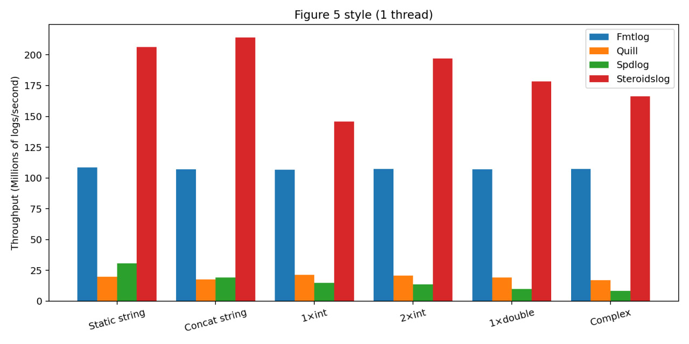
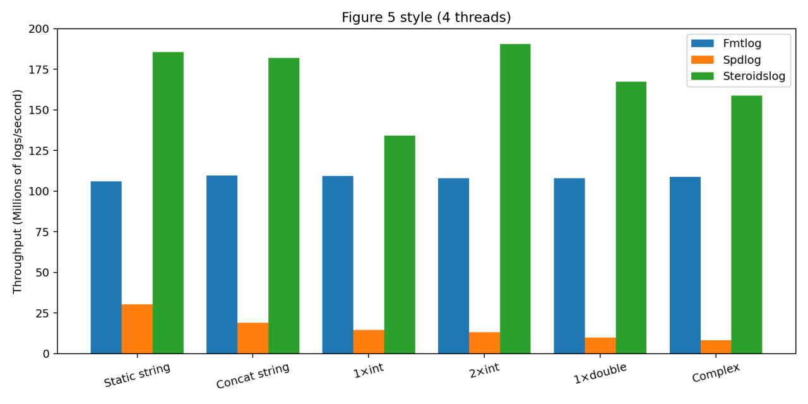

# steroidslog

[](https://github.com/nfedotenko/steroidslog/actions/workflows/ci.yml)&nbsp;
[](https://github.com/nfedotenko/steroidslog/releases/latest)

Steroidslog is a tiny, high‑throughput C++20 logger built for ultra-low latency workloads. The hot path is lock‑free and allocation‑free: a per‑thread SPSC queue records the *format id + raw arguments* in a compact layout and hands them off to a dedicated logger thread which performs the actual formatting and I/O.

<p align="center">
  
  <br/>
  <em>Single-thread microbenchmarks (higher is better)</em>
</p>

<p align="center">
  
  <br/>
  <em>4-thread microbenchmarks (higher is better)</em>
</p>

## Why another logger?

- **Hot‑path cost matters.** In low‑latency systems you pay for every instruction on your producer threads. Steroidslog eliminates formatting and syscalls from the producing thread, pushing them to a single consumer.
- **Predictable performance.** Per‑thread ring buffers avoid cross‑core contention; queues are cache‑line padded and branch‑light to keep tail latency tight.
- **fmt‑style ergonomics.** You write logs with familiar `{}` formatting, but the work happens off the hot path.

## What makes it fast

- **Compile‑time format lookup.** Each log site bakes a `fmt_id` (constexpr hash/registration) so producers only push a small id + arguments. The full format string lives with the consumer.
- **Per‑thread SPSC rings.** Each thread has a bounded SPSC queue to the logger thread. No CAS storms, no shared MPMC; only release/acquire pairs on enqueue/dequeue.
- **Argument shipping, not string building.** Producers store arguments in a fixed set of slots (`uint64_t`/`double`/`string_view`), so *no allocations and almost no copies* on the hot path.
- **Batching at the sink.** The consumer thread formats in batches and flushes to the sink (file/console) to amortize syscalls.

## Performance

Environment: `AMD Ryzen 9 8945HS @ 3.97GHz, Ubuntu 24.04, gcc‑13 -O3 -march=native`

Numbers below are the mean **wall time (ns)** and **throughput (10<sup>6</sup> msgs/s)** obtained from running the [benchmark script](https://github.com/nfedotenko/steroidslog/blob/main/bench/scripts/run_benchmark.sh). Tests mirror the classic "Figure 5"-style microbenchmarks. See the plots above.

### Single-thread

| Test | steroidslog | spdlog | quill | fmtlog |
| :-- | :--: | :--: | :--: | :--: |
| **staticString** | 9.7 ns, 206.19 M/s | 65.4 ns, 30.68 M/s | 259.5 ns, 19.79 M/s | 31.7 ns, 108.48 M/s |
| **stringConcat** | 9.3 ns, 214.07 M/s | 104.1 ns, 19.26 M/s | 461.1 ns, 17.75 M/s | 29.4 ns, 107.06 M/s |
| **singleInteger** | 13.7 ns, 145.83 M/s | 134.1 ns, 14.93 M/s | 306.5 ns, 21.5 M/s | 29.9 ns, 106.81 M/s |
| **twoIntegers** | 10.2 ns, 197.07 M/s | 148.5 ns, 13.48 M/s | 330.7 ns, 20.87 M/s | 29.7 ns, 107.25 M/s |
| **singleDouble** | 11.2 ns, 178.52 M/s | 203.7 ns, 9.83 M/s | 419.8 ns, 19.31 M/s | 29.7 ns, 107.18 M/s |
| **complexFormat** | 12.1 ns, 166.29 M/s | 238.7 ns, 8.38 M/s | 542.2 ns, 16.89 M/s | 29.7 ns, 107.27 M/s |

### 4 threads

| Test | steroidslog | spdlog | quill | fmtlog |
| :-- | :--: | :--: | :--: | :--: |
| **staticString** | 7.1 ns, 185.58 M/s | 42.7 ns, 30.34 M/s | - | 14.7 ns, 105.91 M/s |
| **stringConcat** | 7.1 ns, 182.12 M/s | 68.3 ns, 18.95 M/s | - | 14 ns, 109.5 M/s |
| **singleInteger** | 9.5 ns, 134.28 M/s | 88.4 ns, 14.65 M/s | - | 14.2 ns, 109.24 M/s |
| **twoIntegers** | 6.9 ns, 190.55 M/s | 98.1 ns, 13.18 M/s | - | 14.4 ns, 107.98 M/s |
| **singleDouble** | 7.7 ns, 167.25 M/s | 131.1 ns, 9.96 M/s | - | 14.4 ns, 107.96 M/s |
| **complexFormat** | 8.1 ns, 158.81 M/s | 158.1 ns, 8.19 M/s | - | 14.3 ns, 108.84 M/s |

> [!CAUTION]
> Benchmarks are microbenchmarks; real apps will vary with I/O, sinks, and contention patterns.
> Reproduce locally before drawing conclusions.

## Usage

```cpp
#include <steroidslog/steroidslog.h>

int main() {
    STERLOG_INFO("This is a static string.");
    STERLOG_INFO("order id={} price={}", 42, 123.45);
    STERLOG_DEBUG("vector size={} mean={:.3f}", 100, 0.12345);
    STERLOG_WARN("slow op: {} ms", 22.8);
    STERLOG_ERROR("bad state: msg={}", "some error msg");

    return 0;
}
```

> [!TIP]
> See `example/` for a compact starter (build it with `-O3 -march=native` for best results).

## Install

### Build this repo locally

```bash
git clone https://github.com/nfedotenko/steroidslog.git
cd steroidslog
cmake -S . -B build -DCMAKE_BUILD_TYPE=Release -DBUILD_TESTING=ON
cmake --build build -j
ctest --test-dir build --output-on-failure
```

Optional:
```bash
# Build benchmarks and example
cmake -S . -B build -DCMAKE_BUILD_TYPE=Release \
  -DSTEROIDSLOG_BUILD_BENCH=ON -DSTEROIDSLOG_BUILD_EXAMPLE=ON
cmake --build build/bench -j
```

### Use in another project (CMake)

#### Option A — `FetchContent`

```cmake
include(FetchContent)
FetchContent_Declare(
  steroidslog
  GIT_REPOSITORY https://github.com/nfedotenko/steroidslog.git
  GIT_TAG main
)
FetchContent_MakeAvailable(steroidslog)
target_link_libraries(your_app PRIVATE steroidslog)
```

#### Option B — `add_subdirectory`

```cmake
add_subdirectory(externals/steroidslog) # path you cloned to
target_link_libraries(your_app PRIVATE steroidslog)
```

#### Option C — Single header *(coming soon)*

Copy `steroidslog.h` into your project and include it directly. This is ideal for quick experiments and minimal dependencies.

> [!TIP]
> For best performance, prefer the full build which enables LTO and per-target optimization flags.

## Supported platforms

- **Linux**: GCC (tested 13.3.0 & via CI) and Clang (via CI) on `ubuntu-latest`.
- **Windows**: MSVC (Visual Studio on `windows-latest`) via GitHub Actions.

## Roadmap / TODO

- [x] Compile‑time log‑level filtering
- [ ] Timestamp
- [ ] Different `std::ostream` targets
- [ ] Customizations:
  - [ ] Colored log
  - [ ] Blocking enqueue
  - [ ] Single‑threaded mode
  - [ ] Complex formatter (stuff like `{:.3f}`)
- [ ] Small hot‑path tweaks
- [ ] Single-header version

---

## License

MIT License — see [LICENSE](LICENSE) for details.
